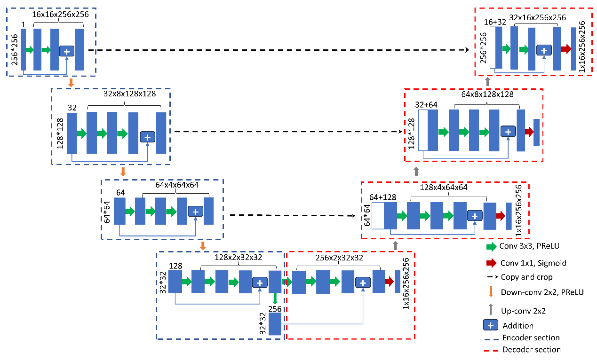
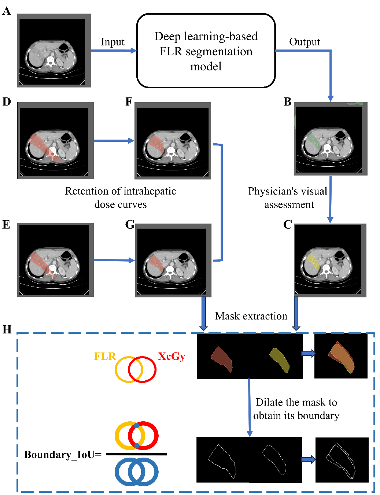

# FLR-boundary-definition

Code for ”Threshold Dose Mapping of Focal Liver Reaction After Radiotherapy Using Deep Learning-Based Segmentation and Boundary IoU on Contrast-Enhanced CT”

FLR is defined as a region of density alteration on post-radiotherapy CT or MRI scans, demonstrating high conformity to the boundaries of the high-dose radiation zone. To date, a consensus on the threshold radiation dose associated with FLR development has not been established.

Figure 1. Schematic illustration of FLR after radiotherapy
(a) Isodose distribution from SBRT in a patient (Patient A) with hepatocellular carcinoma (HCC);
(b) Representative axial image showing typical FLR on contrast-enhanced CT (venous phase) one month after SBRT in Patient A;
(c) Representative axial image showing typical FLR on contrast-enhanced MRI one month after SBRT in Patient A;
(d) Isodose distribution from IMRT in a patient (Patient B) with intrahepatic cholangiocarcinoma (ICC);
(e) Representative axial image showing typical FLR on contrast-enhanced CT (venous phase) six months after IMRT in Patient B;
(f) Representative axial image showing typical FLR on contrast-enhanced CT (venous phase) nine months after IMRT in Patient B.

A U-Net architecture was employed for CT image segmentation to develop the deep learning-based automatic segmentation model.

Figure 2. Schematic diagram of the U-net architecture. 

This code automatically segments FLR regions on CT images with prominent FLR manifestations. It also quantifies the results by calculating the Intersection over Union (IoU) between the segmented FLR region and the boundaries of different isodose curves, thereby identifying the isodose curve that most closely matches the FLR boundary.

Figure 3. Schematic illustration of FLR automatic segmentation and Boundary IoU calculation.
(A) Representative CT image with typical FLR appearance; 
(B) Automatically segmented FLR region; 
(C) Final FLR region after physician visual assessment; 
(D)、(E) Different radiotherapy isodose curves; 
(F)、(G) Intrahepatic portions of different isodose curves; 
(H) Schematic illustration of the Boundary IoU calculation.

